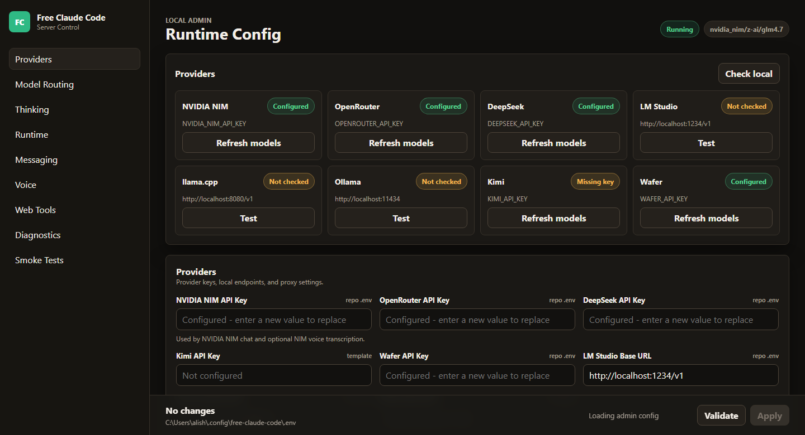

<div align="center">

# 🌀 Claude Chakra

A multi-key Anthropic-compatible proxy for Claude Code CLI, VS Code, and JetBrains ACP. Pool several API keys per provider and rotate them automatically on rate limits.

[](https://opensource.org/licenses/MIT)
[](https://www.python.org/downloads/)
[](https://github.com/astral-sh/uv)
[](https://github.com/itsrajverma/claude-chakra/actions/workflows/tests.yml)
[](https://pypi.org/project/ty/)
[](https://github.com/astral-sh/ruff)
[](https://github.com/Delgan/loguru)

Claude Chakra routes Anthropic Messages API traffic from Claude Code to NVIDIA NIM, Kimi, Wafer, OpenRouter, DeepSeek, LM Studio, llama.cpp, or Ollama. It keeps Claude Code's client-side protocol stable while letting you choose free, paid, or local models — and it can pool **multiple API keys per provider** and rotate to a live key whenever one hits a 429, so a long Claude Code session doesn't stall when one key runs out of quota.

[Quick Start](#quick-start) · [Update](#update-claude-chakra) · [Providers](#choose-a-provider) · [Clients](#connect-claude-code) · [Integrations](#optional-integrations) · [Development](#development)

</div>

## What You Get

- Drop-in proxy for Claude Code's Anthropic API calls.
- Nineteen provider backends — including the **Groq**, **Cerebras**, **Gemini**, **Mistral**, **SambaNova**, **GitHub Models**, **Hugging Face**, and **Chutes** free tiers: NVIDIA NIM, Groq, Cerebras, Google Gemini, Mistral, SambaNova, GitHub Models, Hugging Face, Chutes, OpenRouter, OpenCode Zen, Kimi, DeepSeek, Wafer, Z.ai, Fireworks, LM Studio, llama.cpp, and Ollama. See the [Provider Matrix](#provider-matrix).
- **[Cross-provider fallback](#cross-provider-fallback)**: stack several free tiers in `MODEL_FALLBACKS` and the proxy spills from an exhausted provider to the next one automatically, mid-request — the biggest lever for stretching free quota.
- **`chakra-providers` command**: prints which free providers are configured and a ready-to-paste `MODEL` + `MODEL_FALLBACKS` chain built from them. See the **[Free Usage Guide](docs/FREE_USAGE_GUIDE.md)** for how to run entirely free.
- **Multi-key pooling**: paste several keys per provider (e.g. one per account) and the proxy round-robins them, cooling a key for 60s and rotating on a `429`.
- Per-model routing: send Opus, Sonnet, Haiku, and fallback traffic to different providers.
- Native Claude Code `/model` picker support through the proxy's `/v1/models` endpoint (Claude Code must opt in to Gateway model discovery; see [Model Picker](#model-picker)).
- Streaming, tool use, reasoning/thinking block handling, and local request optimizations.
- Optional Discord or Telegram bot wrapper for remote coding sessions.
- Optional Usage through the VSCode extension.
- Optional voice-note transcription through local Whisper or NVIDIA NIM.
- Local **Admin UI** at `/admin` to edit supported proxy settings, validate changes, and check providers (loopback access only).

## Quick Start

### 1. Install the latest version of [Claude Code](https://code.claude.com/docs/en/overview)

```bash
npm install -g @anthropic-ai/claude-code
```

### 2. Install Runtime Requirements

Install the latest version of [uv](https://docs.astral.sh/uv/getting-started/installation/) and Python 3.14.

macOS/Linux:

```bash
curl -LsSf https://astral.sh/uv/install.sh | sh
uv self update
uv python install 3.14
```

Windows PowerShell:

```powershell
powershell -ExecutionPolicy ByPass -c "irm https://astral.sh/uv/install.ps1 | iex"
uv self update
uv python install 3.14
```

### 3. Get An NVIDIA NIM API Key

Create a free NVIDIA NIM API key, then keep it ready for the Admin UI setup step.

See [NVIDIA NIM provider setup](#nvidia-nim-provider).

### 4. Install The Proxy

From a local checkout:

```bash
uv tool install --force git+https://github.com/itsrajverma/claude-chakra.git
```

### 5. Start The Proxy

```bash
chakra-server
```

After startup, Uvicorn prints the proxy bind address and the app logs the admin URL:

```text
INFO:     Admin UI: http://127.0.0.1:8082/admin (local-only)
```

Many terminals make these clickable. Use your configured `PORT` if it is not `8082`.

### 6. Open The Admin UI And Configure NVIDIA NIM

Open the **Admin UI** URL from the terminal output.

<div align="center">
  
</div>

Paste your NVIDIA NIM API key into `NVIDIA_NIM_API_KEY`, then click **Validate** and **Apply**.

The default model is already set to `nvidia_nim/z-ai/glm4.7`. You can change it later from the same Admin UI.

### 7. Run Claude Code

```bash
chakra-claude
```

`chakra-claude` reads the current configured port and auth token each time it starts, sets the Claude Code environment variables (including a 190k-token `CLAUDE_CODE_AUTO_COMPACT_WINDOW` for auto-compaction), and then launches the real `claude` command.

### 8. Pool Multiple API Keys (Optional)

Every authenticated provider has a paired **"… API Keys (pool)"** textarea in the **Admin UI → Providers** section. Paste a JSON list and click **Validate** + **Apply**:

```env
["nvapi-aaa","nvapi-bbb","nvapi-ccc"]
```

(You can also set `NVIDIA_NIM_API_KEYS` directly in `~/.chakra/.env` if you prefer editing the file.)

When the pool has more than one key the proxy:

- Round-robins assignments per request.
- On a `429 Too Many Requests`, marks the current key as cooling for 60s and immediately retries the same request on the next live key — no bytes are streamed to the client until a key succeeds, so the conversation is never truncated.
- Falls back to the existing exponential-backoff path only when *every* key is cooling.

If both the single key (`NVIDIA_NIM_API_KEY`) and the pool (`NVIDIA_NIM_API_KEYS`) are set, the pool wins. To remove the pool and go back to a single key, clear the textarea and Apply.

## Update Claude Chakra

Claude Chakra is installed as a `uv` tool straight from Git, so updating to the newest version is just a forced re-install — this re-fetches the latest commit and rebuilds the `chakra-*` console scripts:

```bash
uv tool install --force git+https://github.com/itsrajverma/claude-chakra.git
```

`uv tool upgrade claude-chakra` also works for a quick bump. If you installed a voice extra, update with the same extra so it is rebuilt too:

```bash
# NVIDIA NIM transcription
uv tool install --force "claude-chakra[voice] @ git+https://github.com/itsrajverma/claude-chakra.git"
# Local Whisper (CPU/CUDA)
uv tool install --force "claude-chakra[voice_local] @ git+https://github.com/itsrajverma/claude-chakra.git"
```

After updating, restart the proxy so the new build is picked up:

```bash
chakra-server
```

Your configuration in `~/.chakra/.env` is preserved across updates — updating only replaces the code, never your keys or model settings. To check the installed version, run `uv tool list`.

## Choose A Provider

Pick one provider, enter its key or local URL in the Admin UI, and set `MODEL` to a provider-prefixed model slug. `MODEL` is the fallback. `MODEL_OPUS`, `MODEL_SONNET`, and `MODEL_HAIKU` can override routing for Claude Code's model tiers. To chain several providers so a request survives an exhausted quota, see [Cross-Provider Fallback](#cross-provider-fallback).

<a id="provider-matrix"></a>

### Provider Matrix

| # | Provider | Free tier | Transport | Get a key | Example `MODEL` |
| --- | --- | --- | --- | --- | --- |
| 1 | [NVIDIA NIM](https://build.nvidia.com/) | ✅ free credits | OpenAI chat | [api-keys](https://build.nvidia.com/settings/api-keys) | `nvidia_nim/z-ai/glm4.7` |
| 2 | [Groq](https://groq.com/) | ✅ no card, fastest | OpenAI chat | [console.groq.com/keys](https://console.groq.com/keys) | `groq/llama-3.3-70b-versatile` |
| 3 | [Cerebras](https://cerebras.ai/) | ✅ no card, large daily | OpenAI chat | [cloud.cerebras.ai](https://cloud.cerebras.ai/) | `cerebras/qwen-3-coder-480b` |
| 4 | [Google Gemini](https://aistudio.google.com/) | ✅ large daily RPD | OpenAI chat | [aistudio.google.com/apikey](https://aistudio.google.com/apikey) | `gemini/gemini-2.5-flash` |
| 5 | [Mistral](https://mistral.ai/) | ✅ free "Experiment" tier | OpenAI chat | [console.mistral.ai](https://console.mistral.ai/api-keys) | `mistral/mistral-small-latest` |
| 6 | [SambaNova](https://sambanova.ai/) | ✅ persistent free tier | OpenAI chat | [cloud.sambanova.ai](https://cloud.sambanova.ai/apis) | `sambanova/Meta-Llama-3.3-70B-Instruct` |
| 7 | [GitHub Models](https://github.com/marketplace?type=models) | ✅ free with a GitHub PAT | OpenAI chat | [settings/personal-access-tokens](https://github.com/settings/personal-access-tokens) | `github/openai/gpt-4o-mini` |
| 8 | [Hugging Face](https://huggingface.co/) | ✅ free monthly credits | OpenAI chat | [settings/tokens](https://huggingface.co/settings/tokens) | `huggingface/meta-llama/Llama-3.3-70B-Instruct` |
| 9 | [Chutes](https://chutes.ai/) | ✅ free prototyping tier | OpenAI chat | [chutes.ai/app/api](https://chutes.ai/app/api) | `chutes/deepseek-ai/DeepSeek-V3-0324` |
| 10 | [OpenRouter](https://openrouter.ai/) | ✅ many `:free` models | Anthropic msgs | [openrouter.ai/keys](https://openrouter.ai/keys) | `open_router/deepseek/deepseek-chat:free` |
| 11 | [OpenCode Zen](https://opencode.ai/) | ✅ some free models | OpenAI chat | [opencode.ai/auth](https://opencode.ai/auth) | `opencode/big-pickle` |
| 12 | [Kimi](https://platform.moonshot.ai/) | — paid | OpenAI chat | [console](https://platform.moonshot.ai/console/api-keys) | `kimi/kimi-k2.5` |
| 13 | [DeepSeek](https://platform.deepseek.com/) | — paid | Anthropic msgs | [api_keys](https://platform.deepseek.com/api_keys) | `deepseek/deepseek-chat` |
| 14 | [Wafer](https://wafer.ai/) | — paid pass | Anthropic msgs | [wafer.ai](https://wafer.ai) | `wafer/DeepSeek-V4-Pro` |
| 15 | [Z.ai](https://z.ai/) | — coding plan | OpenAI chat | [apikey-list](https://z.ai/manage-apikey/apikey-list) | `zai/glm-5.1` |
| 16 | [Fireworks](https://fireworks.ai/) | — trial credit | OpenAI chat | [api-keys](https://fireworks.ai/account/api-keys) | `fireworks/accounts/fireworks/models/glm-5p1` |
| 17 | [LM Studio](https://lmstudio.ai/) | 🖥️ local | Anthropic msgs | — (local) | `lmstudio/<model>` |
| 18 | [llama.cpp](https://github.com/ggml-org/llama.cpp) | 🖥️ local | Anthropic msgs | — (local) | `llamacpp/<model>` |
| 19 | [Ollama](https://ollama.com/) | 🖥️ local | Anthropic msgs | — (local) | `ollama/llama3.1` |

✅ = usable with a free key (no credit card for Groq / Cerebras / Gemini / GitHub Models / Hugging Face / Chutes) · 🖥️ = runs locally, no key · — = paid only. Every authenticated provider supports a multi-key **pool** (`<PROVIDER>_API_KEYS`) and can be chained via [`MODEL_FALLBACKS`](#cross-provider-fallback).

<a id="nvidia-nim-provider"></a>

### 1. [NVIDIA NIM](https://build.nvidia.com/)

Get a key at [build.nvidia.com/settings/api-keys](https://build.nvidia.com/settings/api-keys).

In the Admin UI, paste it into `NVIDIA_NIM_API_KEY`. The default `MODEL` is `nvidia_nim/z-ai/glm4.7`.

Popular examples:

- `nvidia_nim/z-ai/glm4.7`
- `nvidia_nim/z-ai/glm5`
- `nvidia_nim/moonshotai/kimi-k2.5`
- `nvidia_nim/minimaxai/minimax-m2.5`

Browse models at [build.nvidia.com](https://build.nvidia.com/explore/discover).

### 2. [Kimi](https://platform.moonshot.ai/)

Get a key at [platform.moonshot.ai/console/api-keys](https://platform.moonshot.ai/console/api-keys).

In the Admin UI, paste it into `KIMI_API_KEY`, then set `MODEL` to a Kimi slug such as `kimi/kimi-k2.5`.

Browse models at [platform.moonshot.ai](https://platform.moonshot.ai).

### 3. [Wafer](https://wafer.ai/)

Get a key from [wafer.ai](https://wafer.ai). In the Admin UI, paste it into `WAFER_API_KEY`, then set `MODEL` to a Wafer Pass model such as `wafer/DeepSeek-V4-Pro`.

Popular examples:

- `wafer/DeepSeek-V4-Pro`
- `wafer/MiniMax-M2.7`
- `wafer/Qwen3.5-397B-A17B`
- `wafer/GLM-5.1`

This provider uses Wafer's Anthropic-compatible endpoint at `https://pass.wafer.ai/v1/messages`.

### 4. [OpenRouter](https://openrouter.ai/)

Get a key at [openrouter.ai/keys](https://openrouter.ai/keys).

In the Admin UI, paste it into `OPENROUTER_API_KEY`, then set `MODEL` to an OpenRouter slug such as `open_router/stepfun/step-3.5-flash:free`.

Browse [all models](https://openrouter.ai/models) or [free models](https://openrouter.ai/collections/free-models).

### 5. [DeepSeek](https://platform.deepseek.com/)

Get a key at [platform.deepseek.com/api_keys](https://platform.deepseek.com/api_keys).

In the Admin UI, paste it into `DEEPSEEK_API_KEY`, then set `MODEL` to a DeepSeek slug such as `deepseek/deepseek-chat`.

This provider uses DeepSeek's Anthropic-compatible endpoint, not the OpenAI chat-completions endpoint.

### 6. [LM Studio](https://lmstudio.ai/)

Start LM Studio's local server and load a model. In the Admin UI, keep or update `LM_STUDIO_BASE_URL`, then set `MODEL` to the model identifier shown by LM Studio, prefixed with `lmstudio/`.

Prefer models with tool-use support for Claude Code workflows.

### 7. [llama.cpp](https://github.com/ggml-org/llama.cpp)

Start `llama-server` with an Anthropic-compatible `/v1/messages` endpoint and enough context for Claude Code requests.

In the Admin UI, keep or update `LLAMACPP_BASE_URL`, then set `MODEL` to the local model slug, prefixed with `llamacpp/`.

For local coding models, context size matters. If llama.cpp returns HTTP 400 for normal Claude Code requests, increase `--ctx-size` and verify the model/server build supports the requested features.

### 8. [Ollama](https://ollama.com/)

Run Ollama and pull a model:

```bash
ollama pull llama3.1
ollama serve
```

In the Admin UI, keep or update `OLLAMA_BASE_URL`, then set `MODEL` to the same tag shown by `ollama list`, prefixed with `ollama/`.

`OLLAMA_BASE_URL` is the Ollama server root; do not append `/v1`. Example model slugs include `ollama/llama3.1` and `ollama/llama3.1:8b`.

### 9. [OpenCode Zen](https://opencode.ai/)

Get an API key at [opencode.ai/auth](https://opencode.ai/auth).

In the Admin UI, paste it into `OPENCODE_API_KEY`, then set `MODEL` to an OpenCode Zen model slug such as `opencode/gpt-5.3-codex`.

OpenCode Zen is a curated model gateway that provides access to models from Anthropic, OpenAI, Google, DeepSeek, and more through a single API key and OpenAI-compatible endpoint at `https://opencode.ai/zen/v1`.

Popular examples:

- `opencode/gpt-5.3-codex`
- `opencode/claude-sonnet-4`
- `opencode/deepseek-v4-flash-free` (free)
- `opencode/gemini-3-flash`
- `opencode/big-pickle` (free)
- `opencode/glm-5.1`

Browse available models at [opencode.ai](https://opencode.ai).

### 10. [Z.ai](https://z.ai/)

Get an API key at [Z.ai/manage-apikey/apikey-list](https://z.ai/manage-apikey/apikey-list).

In the Admin UI, paste it into `ZAI_API_KEY`, then set `MODEL` to a Z.ai model slug such as `zai/glm-5.1`.

Z.ai provides GLM models through the OpenAI-compatible Coding Plan endpoint at `https://api.z.ai/api/coding/paas/v4`.

Popular examples:

- `zai/glm-5.1`
- `zai/glm-5-turbo`

Browse models at [Z.ai](https://z.ai).

### 11. [Groq](https://groq.com/)

Free, no credit card, and the fastest inference here. Get a key at [console.groq.com/keys](https://console.groq.com/keys).

In the Admin UI, paste it into `GROQ_API_KEY`, then set `MODEL` to a Groq slug such as `groq/llama-3.3-70b-versatile`.

Popular examples:

- `groq/llama-3.3-70b-versatile`
- `groq/moonshotai/kimi-k2-instruct`
- `groq/qwen/qwen3-32b`
- `groq/openai/gpt-oss-120b`

Free limits are **per key**, so paste one key per account into `GROQ_API_KEYS` (a JSON list) to multiply throughput via round-robin pooling. Browse models at [console.groq.com/docs/models](https://console.groq.com/docs/models).

### 12. [Cerebras](https://cerebras.ai/)

Free, no credit card, one of the largest daily token allowances, and very fast. Get a key at [cloud.cerebras.ai](https://cloud.cerebras.ai/).

In the Admin UI, paste it into `CEREBRAS_API_KEY`, then set `MODEL` to a Cerebras slug such as `cerebras/qwen-3-coder-480b`.

Popular examples:

- `cerebras/qwen-3-coder-480b`
- `cerebras/llama-3.3-70b`
- `cerebras/gpt-oss-120b`

As with Groq, free limits are per key — pool several in `CEREBRAS_API_KEYS`. Browse models at [inference-docs.cerebras.ai](https://inference-docs.cerebras.ai/).

### 13. Mix Providers By Model Tier

Each model tier can use a different provider by setting `MODEL_OPUS`, `MODEL_SONNET`, and `MODEL_HAIKU` in the Admin UI. Leave a tier blank to inherit `MODEL`.

For example, you can route Opus to `cerebras/qwen-3-coder-480b`, Sonnet to `groq/moonshotai/kimi-k2-instruct`, Haiku to `groq/llama-3.3-70b-versatile`, and keep the fallback `MODEL` on `nvidia_nim/z-ai/glm4.7`.

## Cross-Provider Fallback

Free tiers run out. Instead of stalling when one provider hits its quota, stack several in `MODEL_FALLBACKS` and the proxy **spills from an exhausted provider to the next one automatically — mid-request, before the client sees a single byte.** Combine NVIDIA NIM + Groq + Cerebras + OpenRouter free models and you rarely hit a wall.

Set it in the Admin UI (or `~/.chakra/.env`) as a comma-separated string — or a JSON list — of `provider/model` refs:

```env
MODEL=cerebras/qwen-3-coder-480b
MODEL_FALLBACKS=groq/llama-3.3-70b-versatile,nvidia_nim/z-ai/glm4.7,open_router/deepseek/deepseek-chat:free
```

For each request the proxy builds the chain `[tier-resolved MODEL, *MODEL_FALLBACKS]` (duplicates removed) and walks it in order:

1. It tries the first provider, exhausting that provider's own **multi-key pool** (round-robin + 60s cooldown on `429`) and reactive backoff first.
2. If the whole pool is cooling — or the provider returns a `5xx`/auth error — it **advances to the next provider** without streaming anything to the client.
3. The first provider to produce real content **commits**: its output streams straight through. Once content has started, the proxy can't switch providers (bytes are already on the wire), exactly like key rotation.
4. If every provider fails, the client still gets a clean, well-formed error from the last candidate.

Fallbacks compose with per-tier routing — give each tier a fast primary and the same deep bench:

```env
MODEL_OPUS=cerebras/qwen-3-coder-480b
MODEL_SONNET=groq/moonshotai/kimi-k2-instruct
MODEL_HAIKU=groq/llama-3.3-70b-versatile
MODEL_FALLBACKS=nvidia_nim/z-ai/glm4.7,open_router/deepseek/deepseek-chat:free,opencode/big-pickle
```

> Fallback triggers on provider **open failures** (`429` / `5xx` / auth / exhausted key pool). Malformed-request (`400`) errors are not retried across providers, and once a response has started streaming it cannot switch providers. Every model listed in `MODEL_FALLBACKS` is validated against its provider at startup, so a typo fails fast.

## Connect Claude Code

### 1. Claude Code CLI

For terminal use, prefer the installed launcher:

```bash
chakra-claude
```

Keep `chakra-server` running while you work. The Admin UI manages proxy config, restarts the server when runtime settings change, and `chakra-claude` reads the current Admin UI-managed port and auth token every time it starts. It also sets `CLAUDE_CODE_AUTO_COMPACT_WINDOW` to `190000` for auto-compaction.

### 2. VS Code Extension

Open Settings, search for `claude-code.environmentVariables`, choose **Edit in settings.json**, and add:

```json
"claudeCode.environmentVariables": [
  { "name": "ANTHROPIC_BASE_URL", "value": "http://localhost:8082" },
  { "name": "ANTHROPIC_AUTH_TOKEN", "value": "freecc" },
  { "name": "CLAUDE_CODE_ENABLE_GATEWAY_MODEL_DISCOVERY", "value": "1" },
  { "name": "CLAUDE_CODE_AUTO_COMPACT_WINDOW", "value": "190000" }
]
```

Reload the extension. If the extension shows a login screen, choose the Anthropic Console path once; the local proxy still handles model traffic after the environment variables are active.

### 3. JetBrains ACP

Edit the installed Claude ACP config:

- Windows: `C:\Users\%USERNAME%\AppData\Roaming\JetBrains\acp-agents\installed.json`
- Linux/macOS: `~/.jetbrains/acp.json`

Set the environment for `acp.registry.claude-acp`:

```json
"env": {
  "ANTHROPIC_BASE_URL": "http://localhost:8082",
  "ANTHROPIC_AUTH_TOKEN": "freecc",
  "CLAUDE_CODE_ENABLE_GATEWAY_MODEL_DISCOVERY": "1",
  "CLAUDE_CODE_AUTO_COMPACT_WINDOW": "190000"
}
```

Restart the IDE after changing the file.

### 4. Model Picker

<div align="center">
  
</div>

## Optional Integrations

For every integration below, change **managed proxy settings** only in the **Admin UI** at `/admin`: edit fields, click **Validate**, then **Apply**. The footer shows where the managed config is stored; this README does not walk through editing that file by hand.

### 1. Discord And Telegram Bots

The bot wrapper runs Claude Code sessions remotely, streams progress, supports reply-based conversation branches, and can stop or clear tasks.

**Discord**

1. Create the bot in the [Discord Developer Portal](https://discord.com/developers/applications).
2. Enable **Message Content Intent**.
3. Invite the bot with read, send, and message history permissions.
4. Copy the bot token and the numeric channel ID (or IDs) where the bot should respond.

**Telegram**

1. Create a bot with [@BotFather](https://t.me/BotFather) and copy the bot token.
2. Get your numeric user ID from [@userinfobot](https://t.me/userinfobot) so only you can use the bot.

**Configure in the Admin UI**

1. With `chakra-server` running, open the **Admin UI** URL from the terminal output.
2. In the sidebar, choose **Messaging**.
3. Set **Messaging Platform** to **discord** or **telegram**.
4. For Discord, paste **Discord Bot Token** and **Allowed Discord Channels**. For Telegram, paste **Telegram Bot Token** and **Allowed Telegram User ID**.
5. Set **Allowed Directory** to an absolute path on the machine running the proxy—the workspace root the bot may use.
6. Click **Validate**, then **Apply**. Restart the server if the UI says one is required.

<div align="center">
  
</div>

<p align="center"><em>Admin UI → Messaging (platform, bots, and Voice)</em></p>

**Useful commands**

- `/stop` cancels a task; reply to a task message to stop only that branch.
- `/clear` resets sessions; reply to clear one branch.
- `/stats` shows session state.

### 2. Voice Notes

Voice notes work on Discord and Telegram after you extend your [proxy install](#4-install-the-proxy) with the matching optional extras. Re-run `uv tool install --force` with the extras you need (same Git URL as Quick Start):

```bash
# NVIDIA NIM transcription (Riva gRPC)
uv tool install --force "claude-chakra[voice] @ git+https://github.com/itsrajverma/claude-chakra.git"

# Local Whisper (CPU or CUDA)
uv tool install --force "claude-chakra[voice_local] @ git+https://github.com/itsrajverma/claude-chakra.git"

# Both backends
uv tool install --force "claude-chakra[voice,voice_local] @ git+https://github.com/itsrajverma/claude-chakra.git"
```

For **cuda** local Whisper, add `--torch-backend cu130` to the `voice_local` install command. Restart `chakra-server` after reinstalling.

In the **Admin UI**, open **Messaging** and scroll to **Voice**. Turn on **Voice Notes**, choose **Whisper Device** (`cpu`, `cuda`, or `nvidia_nim`), set **Whisper Model**, and enter **Hugging Face Token** when your setup needs it. For **nvidia_nim** transcription, install the `voice` extra and set **NVIDIA NIM API Key** on the **Providers** view. The screenshot above shows the **Voice** block in the same view.

## How It Works

<div align="center">
  
</div>

Diagram source: [`assets/how-it-works.mmd`](assets/how-it-works.mmd).

Important pieces:

- FastAPI exposes Anthropic-compatible routes such as `/v1/messages`, `/v1/messages/count_tokens`, and `/v1/models`.
- Model routing resolves the Claude model name to `MODEL_OPUS`, `MODEL_SONNET`, `MODEL_HAIKU`, or `MODEL`.
- NIM, Groq, Cerebras, Gemini, Mistral, SambaNova, GitHub Models, Hugging Face, Chutes, Fireworks, OpenCode Zen, and Z.ai use OpenAI chat streaming translated into Anthropic SSE.
- Wafer, OpenRouter, DeepSeek, LM Studio, llama.cpp, and Ollama use Anthropic Messages style transports.
- When `MODEL_FALLBACKS` is set, the proxy walks the provider chain and only commits a response once a provider returns real content (see [Cross-Provider Fallback](#cross-provider-fallback)).
- The proxy normalizes thinking blocks, tool calls, token usage metadata, and provider errors into the shape Claude Code expects.
- Request optimizations answer trivial Claude Code probes locally to save latency and quota.

## Development

### 1. Project Structure

```text
claude-chakra/
├── server.py              # ASGI entry point
├── api/                   # FastAPI routes, service layer, routing, optimizations
├── core/                  # Shared Anthropic protocol helpers and SSE utilities
├── providers/             # Provider transports, registry, rate limiting, key_pool
├── messaging/             # Discord/Telegram adapters, sessions, voice
├── cli/                   # Package entry points and Claude process management
├── config/                # Settings, provider catalog, logging
└── tests/                 # Unit and contract tests
```

### 2. Run From Source

Use this path if you are developing or want to run directly from a checkout:

```bash
cd claude-chakra
uv run uvicorn server:app --host 0.0.0.0 --port 8082
```

### 3. Commands

```bash
uv run ruff format
uv run ruff check
uv run ty check
uv run pytest
```

Run them in that order before pushing. CI enforces the same checks.

### 4. Package Scripts

`pyproject.toml` installs:

- `chakra-server`: starts the proxy with configured host and port.
- `chakra-init`: optional advanced scaffold for `~/.chakra/.env`; prefer the **Admin UI** for normal configuration.
- `chakra-claude`: launches Claude Code with the configured local proxy URL, auth token, model discovery flag, and a 190k `CLAUDE_CODE_AUTO_COMPACT_WINDOW` for auto-compaction.
- `claude-chakra`: compatibility alias for `chakra-server`.

### 5. Extending

- Add OpenAI-compatible providers by extending `OpenAIChatTransport`.
- Add Anthropic Messages providers by extending `AnthropicMessagesTransport`.
- Register provider metadata in `config.provider_catalog` and factory wiring in `providers.registry`.
- Add messaging platforms by implementing the `MessagingPlatform` interface in `messaging/`.

## Contributing

- [`.env.example`](.env.example) lists env key names as a read-only reference for contributors; use the **Admin UI** to change managed proxy settings.
- Report bugs and feature requests in [Issues](https://github.com/itsrajverma/claude-chakra/issues).
- Keep changes small and covered by focused tests.
- Do not open Docker integration PRs.
- Do not open README change PRs just open an issue for it.
- Run the full check sequence before opening a pull request.
- The syntax `except X, Y` is brought back in python 3.14 final version (not in 3.14 alpha). Keep in mind before opening PRs.

## License

MIT License. See [LICENSE](LICENSE) for details.
